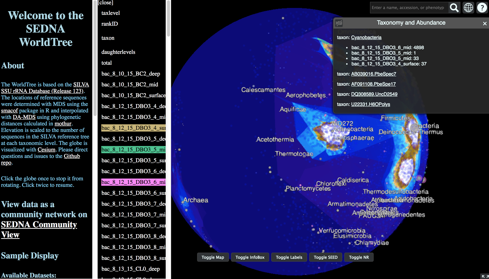
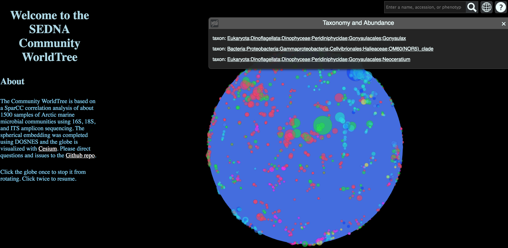
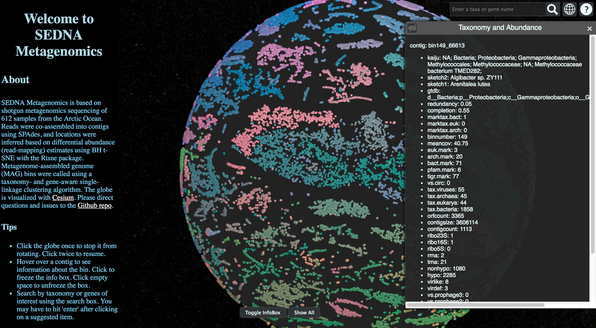

# sedna

SEDNA is a graphical exploration tool for microbiome research and educational outreach.

Try SEDNA WorldTree, based on 16S and 18S rRNA sequences from SILVA: http://www.cryomics.org/sedna

Try SEDNA Communities, based on SparCC correlation networks: http://www.cryomics.org/sedna_comm

Try SEDNA Metagenomes, based on differential coverage of contig abundances: http://www.cryomics.org/sedna_mg

